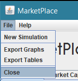

# Market Simulator
## Note
This project was previously hosted on GitLab as the individual capstone challenge for University of Essex's CE301 module. The course module required students to create issues on Jira.
I have no idea how to import those issues, or if it's even possible. This repo was created on July 30, 2019, while the original GitLab repo was created in September 2018.
I'm very sorry for any confusion caused, the University's silly policy is to blame.

### Structure of project
The project uses agents that buy and sell stocks to one another in order to simulate a functional stock exchange. 
Elements of the stock exchange can be changed to study the effects of certain factors on the behaviour of the market as a whole.

The code uses four main classes:
- Agent class
- Stock class
- Company class
- MarketPlace class

### Agent class
The Agent class is an object modelled after stock traders in the stock exchange. An object of type Agent contains all the information 
a stock trader would require to exist and complete operations in the marketplace, albeit simplified. In reality, stock traders don't 
directly buy or sell stocks from one another but through the employ of a stock broker who handles the transaction in their stead.

## Stock class
The Stock class is an object modelled after actual stocks published by companies in stock markets. While simplified for practical purposes,
these objects represent common stock which exist in the hands of stock traders and are sold and bought in a stock exchange. In reality there are 
many different types of securities passed around in a marketplace, however this project focuses on equity securities, the simplest of which is 
the common stock.

## Company class
The Company class is an object modelled after companies in the stock exchange. A company object does not technically interact with any agent in the
marketplace, but merely holds certain variables necessary to determining indices related to the company's stock.

## Marketplace class
The MarketPlace class serves as the environment in which the Agents, Stocks, Companies and their interactions exist and operate.
Its main purpose is to initialise instances of each of the main class objects and through performing updating operations, 
enables for the definition of a time dimension.

## Getting Started (Software Based)

### Prerequisites
The final product will be in the form of an executable file which requires an appropriate runtime environment:
* [Java SE RunTime Environment 8](https://www.oracle.com/technetwork/java/javase/downloads/index.html) 

### Installing
To compile the code on your own, simply download the MarketSimulator folder and from outside it use the following commands in a terminal: 

```
javac MarketSimulator/*.java
java MarketSimulator.Main
```

### Using the application
When the application is first run, the user will be faced with a frame containing settings for the simulation. 
Default settings are preselected, however the user is free to customise these settings.
#### Customising Simulation settings
There are 3 main settings the user can change to their liking.
These settings are: 
- the number of agents
- the number of stocks
- the number of days the simulation runs


There exists an additional setting for the user to customise. This setting is brought up through clicking the _Advanced Settings_ button. A new frame 
is brought up with sliders for the Overcommitment setting.
Overcommitment is the weight that controls the amount of stock an agent may purchase in a transaction.


A sample output of a simulation with 10 agents trading 10 stocks for 50 days would look like this:


#### Menu bar


An added feature of the program is the menu bar, holding various functionality available to the user.
##### File
In the file submenu, the user is free to start a new simulation, export the graphs to JPEG, export the tables to CSV files or close the application.
##### Help
In the help submenu, the user can find a link to this repository where they may look for information or raise an issue.

### Versioning Strategy
This project will be employing [semantic versioning](https://semver.org/).

## Getting Started (Hardware Based)

### Pre-requisites
No hardware pre-requisites exist.

### References
[Matthew Palmer's TODO markdown language](https://github.com/matthewpalmer/.todo)

[Font used in the application](https://fontmeme.com/fonts/sulphur-point-font/)

## Authors
* Alexandros Antoniou
